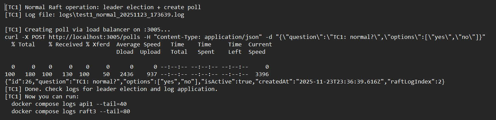
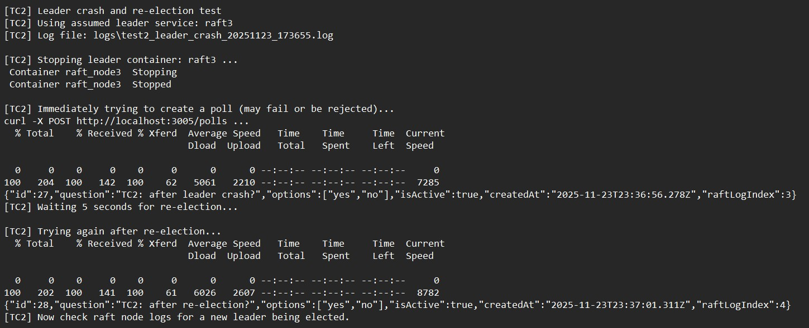
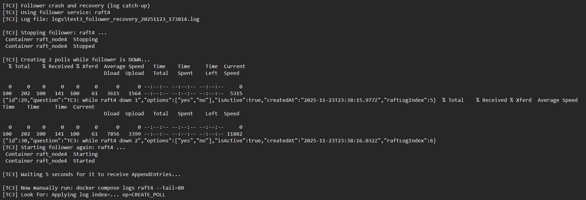
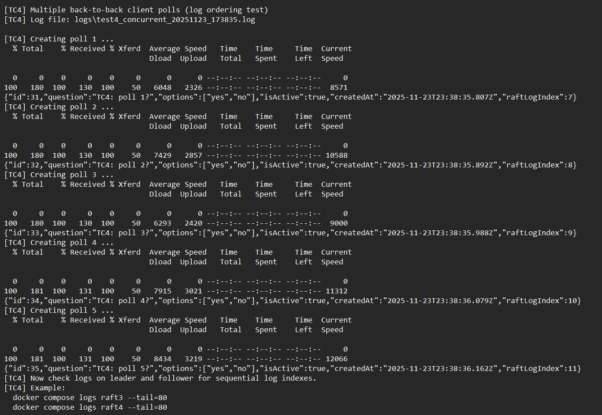
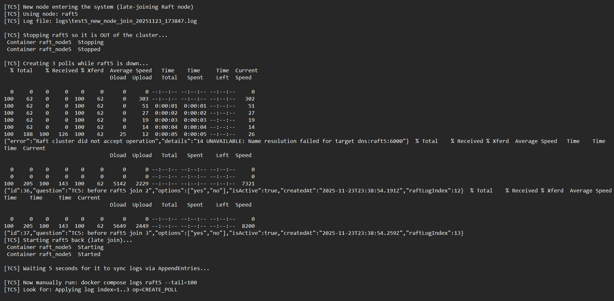

# CSE5306 PA3 — Fault‑Tolerant Extensions Using 2PC and Raft  
**Student Name:** Faisal Ahmad
**Student ID:** 1002239354  
**Link to Project Repository - https://github.com/faisal-ahm/CSE5306-PA3**


---

# 1. Introduction
This report documents the design and implementation of Two‑Phase Commit (2PC) and Raft consensus algorithms added to the base distributed polling system from CSE5306 Project 2 (Made by Group-3). The work extends a REST‑based polling backend with two independent fault‑tolerance mechanisms.

**Link to Original Base Project Repository - https://github.com/CSE-5306-004-DISTRIBUTED-SYSTEMS/Project2**

---

# 2. Original Base Project
Summary of base project:
- REST API implemented using Hono (Node.js)
- Stateless backend containers (api1, api2)
- PostgreSQL single database instance
- Nginx load balancer in front of APIs
- Standard CRUD for polls and votes

The base system had **no fault‑tolerant write mechanism**. Both 2PC and Raft implementations extend the **CreatePoll** path only.

---

# 3. Two‑Phase Commit (Q2)

## 3.1 System Architecture
The 2PC version adds:
- One Coordinator (inside `api/`)
- Four Participant Nodes (`two_pc_participant/`)
- gRPC communication via `two_pc.proto`

Data flow for `/polls`:
1. API receives poll creation request
2. API starts a 2PC transaction:
   - Sends `RequestVote` to all participants
   - If all vote YES → send `SendDecision(COMMIT)`
   - Else → `SendDecision(ABORT)`
3. API writes poll to DB only after COMMIT

This ensures atomicity.

---

# 4. Raft Leader Election (Q3)

## 4.1 Architecture
Implemented in:
```
base_rest_raft/raft_node/src/server.ts
```

Each of 5 Raft nodes:
- Starts as follower
- Waits randomized 1.5–3.0s election timeout
- If no heartbeat → becomes candidate
- Increments term
- Votes for itself
- Broadcasts RequestVote to peers
- If receives majority → becomes leader
- Sends heartbeat every 1s

The API communicates with Raft using the entry node.

---

# 5. Raft Log Replication (Q4)

## 5.1 Operation Flow
When a client creates a poll:
1. API sends `HandleClient` RPC to Raft
2. If caller is not leader → leader redirect
3. Leader:
   - Appends log entry (`CREATE_POLL`)
   - Sends AppendEntries (log + commitIndex)
4. Followers:
   - Overwrite log with leader’s log
   - Apply committed entries
5. Leader updates commit index immediately (simplification per assignment)
6. API writes poll to DB after commit

This satisfies Q4 requirements.

---

# 6. Test Cases (Q5)

All logs are stored in:
```
base_rest_raft/logs/
```

### Test Case 1 — Normal Operations  
- Start cluster normally  
- Submit poll  
- Leader receives operation, replicates, commits  

**Output**


---

### Test Case 2 — Leader Crash  
- Identify leader using logs  
- `docker compose stop raftX`  
- Observe election timeout  
- New leader chosen  
- Submit poll → success  



---

### Test Case 3 — Follower Recovery  
- Stop follower  
- Leader continues  
- Restart follower  
- Leader sends AppendEntries  
- Log catches up  




---

### Test Case 4 — Concurrent Poll Creation  
- Rapid `curl` requests  
- Log shows proper ordering and replication  




---

### Test Case 5 — New Node Joining  
- `docker compose up -d raft5` after removal  
- Node boots as follower  
- Receives full log on heartbeat  
- Catches up  




---

# 7. Directory Structure Summary
Full structure included exactly as submitted (see appendix in repo).

---

# 8. Implementation Notes and Challenges
- Election storms occurred early due to short initial timeouts
- Fixed by implementing correct timeout randomization
- Database commits triggered only on successful Raft commit
- 2PC path isolated and independent from Raft path

---

# 9. Conclusion
This project successfully implemented:
- A fully working 2PC protocol  
- A fully working Raft cluster with leader election  
- A log replication system  
- Integration of consensus mechanisms into the existing REST stack  
- Five documented test cases verifying correctness  

All requirements for Q2–Q5 were satisfied.

---

# Appendix: Log Files
Located in:
```
base_rest_raft/logs/
```
